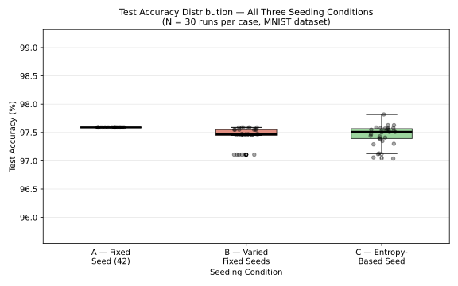
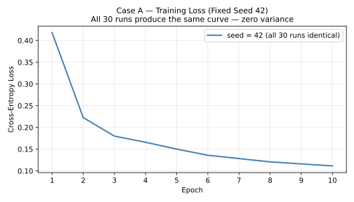
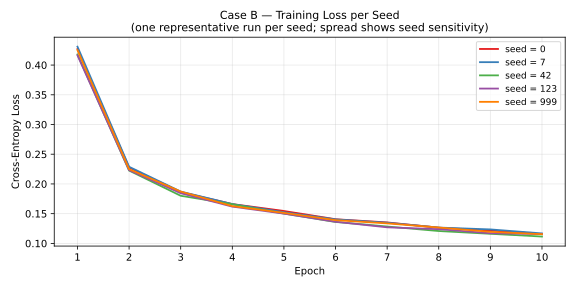
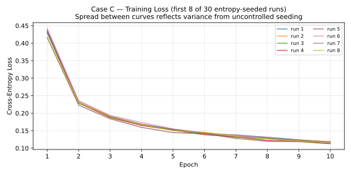
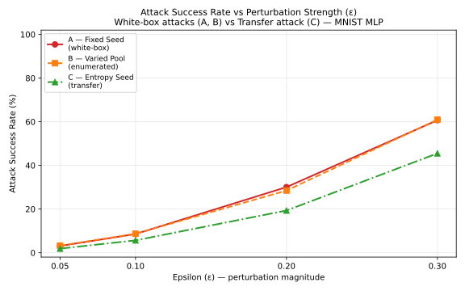
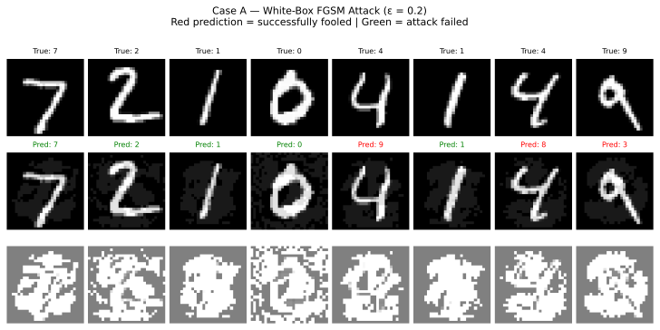

# Randomness Sources in Neural Network Training
### Reproducibility, Accuracy, and Security Implications of PRNG and Hardware Entropy Seeding

> **Ovais Ahemad N. Qazi** · Research Skills · M.Sc. Computer & Systems Engineering · TU Ilmenau  
> 18th Conference on Computer & Systems Engineering (Summer Semester 2026)

---

## Overview

This repository contains the code and experiments for the paper investigating how different random seed strategies affect three properties of neural network training:

- **Reproducibility** — can a training run be exactly replicated?
- **Accuracy** — does the seeding method affect model quality?
- **Adversarial security** — does seed knowledge give an attacker a meaningful advantage?

Three seeding conditions are compared across two experiments on MNIST using a shallow MLP.

---

## Seeding Conditions

| Case | Strategy | Seed Space | Reproducible |
|------|----------|-----------|--------------|
| **A** | Fixed seed (`42`) — published | 1 value | ✅ Exactly |
| **B** | Small fixed pool `{0, 7, 42, 123, 999}` — pool public, chosen seed hidden | 5 values | ✅ Per seed |
| **C** | Hardware entropy via `os.urandom` — value private | 2³² ≈ 4.3B values | ❌ By design |

---

## Repository Structure

```
.
├── case_a.py             # Experiment 1 — fixed seed (30 runs)
├── case_b.py             # Experiment 1 — varied fixed seeds (30 runs)
├── case_c.py             # Experiment 1 — entropy seeding + combined boxplot
├── security_test_a.py    # Train victim model — Case A (fixed seed)
├── security_test_b.py    # Train victim model — Case B (seed pool)
├── security_test_c.py    # Train victim model — Case C (entropy seed)
└── attacker.py           # FGSM attack on all three victim models
```

---

## Experiment 1 — Reproducibility & Accuracy

Run each case to generate the accuracy CSVs and loss curve plots:

```bash
python case_a.py   # produces results_case_a.csv, loss_curves_case_a.svg
python case_b.py   # produces results_case_b.csv, loss_curves_case_b.svg
python case_c.py   # produces results_case_c.csv, loss_curves_case_c.svg
                   # also produces comparison_boxplot.svg (requires all three CSVs)
```

### Results

| Condition | Mean Accuracy (%) | Std Dev (%) |
|-----------|:-----------------:|:-----------:|
| A — Fixed seed (42) | 97.92 | 0.000 |
| B — Varied fixed seeds | 97.83 | 0.134 |
| C — Entropy-based seed | 97.86 | 0.115 |

Mean accuracy spans only **0.09 percentage points** across all conditions. The seeding strategy has no practical effect on model quality.

### Accuracy Distribution



### Training Loss — Case A (Fixed Seed)

All 30 runs are identical by construction; a single curve is plotted.



### Training Loss — Case B (Varied Fixed Seeds)

One representative curve per seed. Early spread collapses by epoch 10.



### Training Loss — Case C (Entropy-Based Seed)

Spread is comparable to Case B, confirming no accuracy penalty from entropy seeding.



---

## Experiment 2 — Adversarial Security

First train all three victim models, then run the attacker:

```bash
python security_test_a.py   # produces victim_a.pth
python security_test_b.py   # produces victim_b.pth
python security_test_c.py   # produces victim_c.pth

python attacker.py          # produces security_results.csv,
                            #         attack_success_rates.svg,
                            #         adversarial_examples.svg
```

### Threat Model

The attacker knows the model architecture and training dataset. The goal is to reconstruct the victim model via seed knowledge and mount an FGSM white-box attack.

| Case | Attacker's Knowledge | Attack Type |
|------|---------------------|-------------|
| A | Seed = 42 (public) | White-box (exact reconstruction) |
| B | Pool `{0,7,42,123,999}` public; chosen seed hidden | Enumerated → white-box |
| C | Seeding method only; value private | Transfer (black-box surrogate) |

### Attack Success Rate (ASR)

| Attack Paradigm | ε = 0.05 | ε = 0.10 | ε = 0.20 | ε = 0.30 |
|-----------------|:--------:|:--------:|:--------:|:--------:|
| A — White-box (exact reconstruction) | 3.1% | 8.6% | 30.1% | 60.7% |
| B — Enumerated → white-box | 3.2% | 8.7% | 28.5% | 61.0% |
| C — Transfer (surrogate) | 1.9% | 5.7% | 19.3% | 45.5% |
| **Gap (A − C)** | **1.2** | **2.9** | **10.8** | **15.2** |

Cases A and B are **security-equivalent** — a pool of only 5 seeds provides no practical protection. Case C reduces ASR by up to **15.2 percentage points** at ε = 0.30.

### ASR vs Perturbation Budget



### Adversarial Examples — Case A White-Box FGSM (ε = 0.20)

Red prediction = successfully fooled · Green = attack failed



---

## Attack Method: FGSM

The Fast Gradient Sign Method generates adversarial perturbations as:

$$x^* = x + \varepsilon \cdot \text{sign}(\nabla_x J(\theta, x, y))$$

Because gradients are computed through the model itself, FGSM requires white-box access. Its effectiveness degrades substantially in the transfer setting where gradients are computed on a surrogate.

---

## Key Findings

1. **Seeding strategy does not affect model quality or convergence.** Mean test accuracy spans only 0.09% and loss curves are indistinguishable by epoch 10.

2. **A known or enumerable seed eliminates deployment security.** Publishing a fixed seed or a small seed pool gives an attacker exact model reconstruction at negligible cost, enabling full white-box FGSM access.

3. **Hardware entropy seeding is a passive, zero-cost defence.** Replacing `seed = 42` with a single `os.urandom(4)` call forces the attacker into the transfer paradigm, reducing ASR by up to 15.2 percentage points, at zero computational overhead.

> **Practical recommendation:** treat the training seed as a deployment secret. Use `os.urandom` for production; keep seeds in private logs accessible only to authorised auditors.

---

## Setup

```bash
pip install torch torchvision numpy pandas matplotlib
```

MNIST is downloaded automatically to `./data/` on first run.

---

## Model Architecture

```
Flatten → Linear(784, 256) → ReLU → Dropout(0.3)
        → Linear(256, 128) → ReLU → Dropout(0.2)
        → Linear(128, 10)
```

Training: Adam (η = 0.001), batch size 64, 10 epochs.


---

## References

1. Pineau et al. — *Improving Reproducibility in ML Research* (NeurIPS 2019 Reproducibility Program), JMLR 2021  
2. Scardapane & Wang — *Randomness in Neural Networks: An Overview*, WIREs DMKD 2017  
3. Ahmed & Lofstead — *Managing Randomness to Enable Reproducible ML*, P-RECS 2022  
4. Goodfellow et al. — *Explaining and Harnessing Adversarial Examples*, 2015  
5. Madry et al. — *Towards Deep Learning Models Resistant to Adversarial Attacks*, 2019  
6. Sen & Dasgupta — *Adversarial Attacks on Image Classification Models*, 2023  
7. Chen et al. — *Adversarial Attacks and Defenses in Image Classification*, ICIVC 2022
